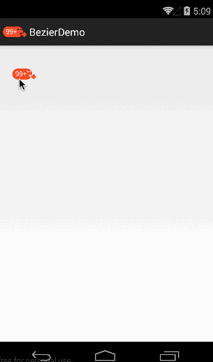

##	实现仿QQ未读消息效果##
###布局
<code>

	<com.bob.bezierview.BezierView
        android:layout_width="match_parent"
        android:layout_height="match_parent"
        android:id="@+id/bezier"
        android:background="@android:color/transparent" />

</code>

###MainAcitity.java
<code>

	public class MainActivity extends Activity {

	    private BezierView mBezierView;
	    @Override
	    protected void onCreate(Bundle savedInstanceState) {
	        super.onCreate(savedInstanceState);
	        setContentView(R.layout.activity_main);
	        mBezierView = (BezierView) findViewById(R.id.bezier);
	        mBezierView.setText("14");          //设置未读信息数
	        //mBezierView.setNewText();     //设置有新的信息状态
	    }

	}

</code>

###效果图
